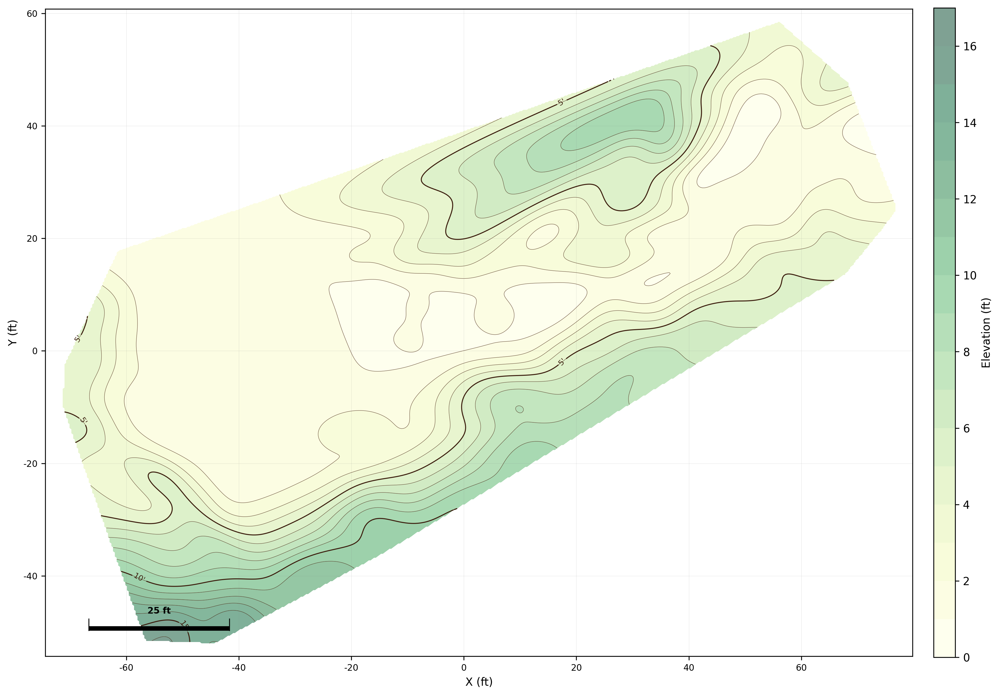

# topogen

Generate topographic contour maps from Scaniverse 3D scan exports. Outputs top-down contour maps as PNG images or DXF files for import into CAD tools like Vectorworks.



```sh
uv run python cli.py scan.ply -o topo_map.png --smooth 3.0 --filter 3
```

## Setup

Requires [uv](https://docs.astral.sh/uv/).

```sh
uv sync
```

## CLI Usage

```sh
uv run python cli.py <input.ply> [options]
```

Or via the installed script:
```sh
uv run topogen <input.ply> [options]
```

### Examples

PNG image with default settings (1ft contour interval):
```sh
uv run python cli.py scan.ply -o topo_map.png
```

DXF for Vectorworks with simplified contours:
```sh
uv run python cli.py scan.ply -o topo_map.dxf --simplify 0.3
```

Smoothed ground with outlier filtering:
```sh
uv run python cli.py scan.ply -o topo_map.png --smooth 2.0 --filter 3
```

## GUI

A desktop GUI built with DearPyGui for interactive parameter tuning:

```sh
uv run python gui.py
```

Or via the installed script:
```sh
uv run topogen-gui
```

1. Click **Open PLY File** to load a scan
2. Adjust sliders for smooth, filter, simplify, interval, and resolution
3. Click **Generate** to render the preview
4. Click **Save PNG** or **Save DXF** to export

### Options

| Option | Default | Description |
|---|---|---|
| `-o, --output` | `topo_map.png` | Output path. Use `.png` for image, `.dxf` for CAD. |
| `--interval` | `1.0` | Contour line interval in feet. |
| `--resolution` | `500` | Grid interpolation resolution (cells per axis). |
| `--dpi` | `300` | PNG image resolution. |
| `--smooth` | `1.0` | Gaussian smoothing sigma in feet. `0` = off. Higher values blur more. |
| `--filter` | `0` | Outlier removal strength in MADs. `0` = off. Try `2`–`5`; lower = more aggressive. |
| `--simplify` | `0` | Douglas-Peucker contour simplification tolerance in feet. `0` = off. Try `0.3`–`1.0`. |

### Tips

- **Keep walls/structures as landmarks**: skip `--filter` and use `--simplify 0.3` to clean up lines without removing elevation features useful for overlaying blueprints.
- **Clean ground-only topo**: use `--filter 3 --smooth 2.0` to remove walls/objects and smooth terrain.
- **DXF layers**: exported DXF files contain `CONTOUR` (1ft lines), `CONTOUR_INDEX` (bold 5ft lines), and `CONTOUR_LABEL` (elevation text) layers. Polylines are set at their correct elevation for 3D use.

## Supported input formats

- `.ply` — point cloud (Scaniverse default export)
